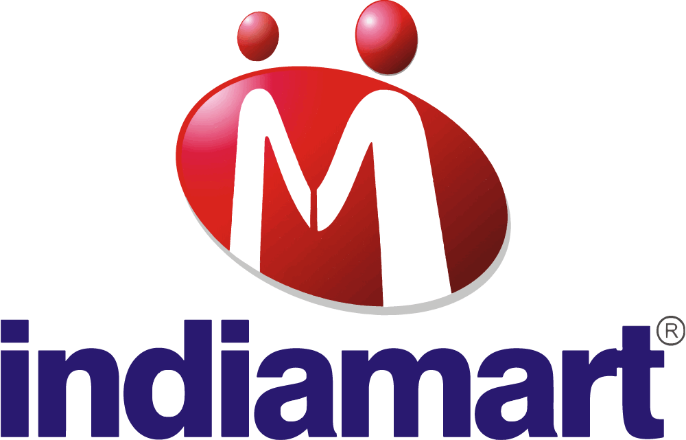
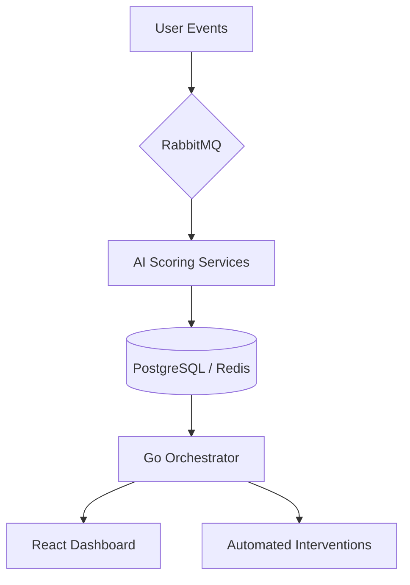

# MarketplaceOS-Indiamart Intelligence Platform



MarketplaceOS-Indiamart Intelligence Platform is an AI intelligence layer designed to eliminate seller churn and maximize marketplace growth. By synthesizing real-time behavioral signals, historical performance, and predictive AI, it transforms reactive account management into proactive seller success.

---

## 💎 The Vision
Marketplaces typically lose 25-35% of their seller base annually. Traditional detection methods are manual and lag by days. MarketplaceOS reduces this latency to **under 4 hours**, protecting millions in revenue through automated, high-precision interventions.

---

## 🚀 Core Intelligence Modules

### 🧠 Real-time Churn Engine
Predicts seller churn risk using a multi-factor behavioral analysis:
- **Engagement Decay**: Tracking login frequency and notification open rates.
- **Consumption Patterns**: Monitoring lead utilization and quota exhaustion.
- **Operational Health**: Analyzing response latency and catalog quality trends.


### 🤖 AI Success Coach (Powered by Gemini 2.5)
Generative AI agents provide hyper-personalized coaching directly to sellers:
- **Actionable Insights**: "Your response time is 4x slower than competitors. Respond to Lead #445 within 10 minutes to increase conversion by 3x."
- **Sales Console Integration**: Automates the generation of executive summaries and intervention strategies for sales teams.

---

## 🏗️ Technical Architecture

### **The Intelligence Pipeline**


### **Tech Stack**
- **Frontend**: React 19, Vite, Tailwind CSS, Framer Motion, Recharts.
- **Backend**: Go, Python (FastAPI).
- **Messaging**: RabbitMQ (High-throughput event bus).
- **Storage**: PostgreSQL (Persistent) & Redis (Real-time Cache).
- **AI**: Google Gemini 2.5 Flash Lite (via OpenRouter).

---

## 🤖 Agentic Skills

The platform is architected around modular "Skills" that can be deployed independently:
- **`seller-health-scoring`**: Continuous real-time health assessment.
- **`behavioral-analytics`**: Deep-dive pattern recognition for disengagement.
- **`lead-routing-optimization`**: The composite engine for lead distribution.
- **`marketplace-orchestration`**: The glue connecting AI insights to business actions.

---

## 📈 Predicted Business Impact

| Metric | Legacy Process | MarketplaceOS | Gain |
| :--- | :--- | :--- | :--- |
| **Churn Detection** | Days | **2-4 Hours** | 🚀 70% Faster |
| **Seller Retention** | 82% | **89%** | 📈 +7% Growth |
| **Sales Efficiency** | 160 hrs/mo | **40 hrs/mo** | ⚡ 75% Savings |
| **Revenue ROI** | 1.8x | **3.2x** | 💰 +78% |

---

## 🛠️ Getting Started

### 1. Clone & Configure
```bash
git clone https://github.com/shivanix34/10x-ai-hackathon.git
cd 10x-ai-hackathon
```

### 2. Environment Setup
Create a `.env` file in the root directory:
```env
OPENROUTER_API_KEY=your_api_key
```

### 3. Deploy with Docker
```bash
cd infrastructure
docker-compose up -d --build
```

The Intelligence Dashboard will be available at `http://localhost:3000`.

---
*Built for the 10x AI Hackathon | Precision Engineering for Marketplace Growth*
